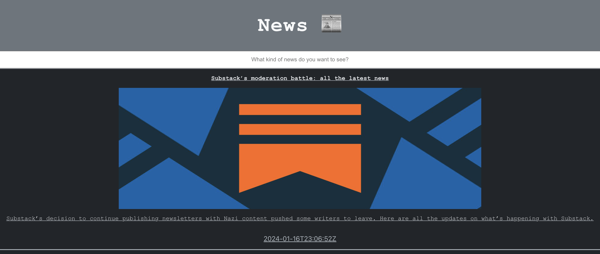
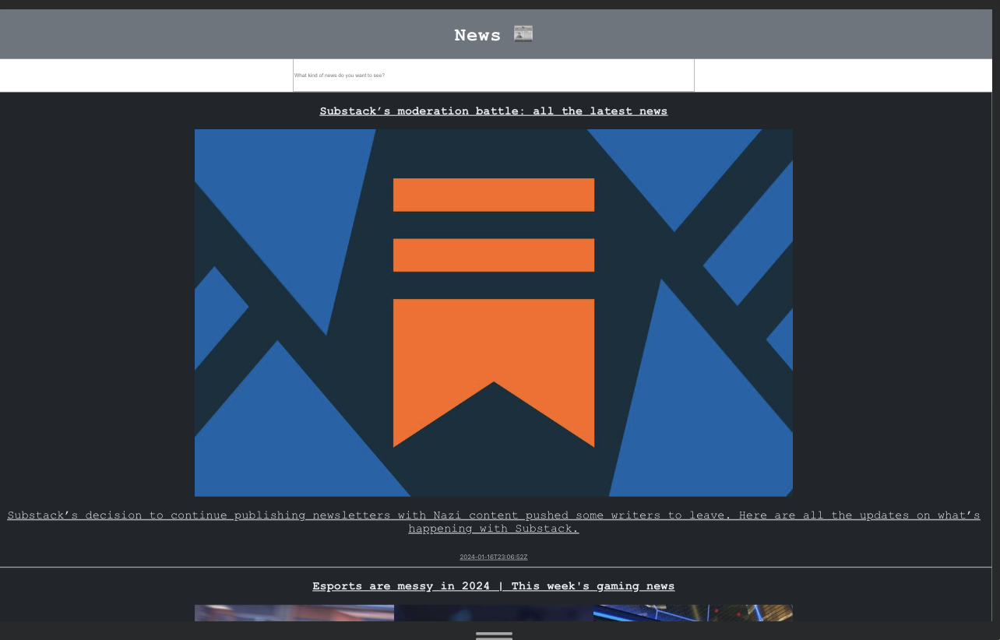

<h1 align=center> 📰News App 📰<h1> 

 

## 🧑‍💻 Contributors 
 
[Ben Rosner](https://github.com/ben-rosner-williamsburg)

## 📂 Tech Stack 

## 📚 Table of Contents

- [Overview](#overview)
- [Getting Started](#getting-started)
- [Preview](#preview)
- [Wins](#wins)
- [Future Ideas](#future-ideas)

<h2  id="overview">🌐 Overview </h2>

The News App is a way to search for news articles online using the News API. Users can search for topics with the search bar. The app is fully responsive across desktop, mobile and tablet.

<h2  id="getting-started">🗂️ Getting Started </h2>

1. Fork or clone down this respository. 
2. In the terminal, open this app by running the command `cd news-app`
3. Run the command  `npm install` to install dependencies.
4. Run the command `npm start` to start the server.
5. Open [http://localhost:3000](http://localhost:3000) to view it in your browser.
6. Use control C to stop the server.

<h2  id="preview"> 🎥 Preview 📱 </h2>

 <h2 id="challenges">💪🏻 Challenges </h2>

💪🏻 Getting the search bar implemented.

💪🏻 Time management and timeboxing this project to 8 hours.

💪🏻 Implementing a unique id when the API doesn't provide you with one.

<h2 id="wins">🏆 Wins </h2>

🏆 Getting responsive design implmeneted quickly.
  
🏆 Using state and props in React

🏆 Using em units and percentages instead of pixels

<h2 id="future-ideas">💡 Future Ideas </h2>

🔮 Add error handling

🔮 Add Cypress tests

🔮 Clean data so that it doesn't display the full unicode date.